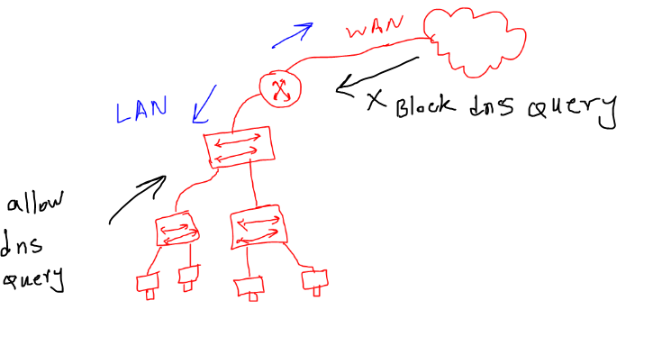

# MTCSE (MiKroTik Certified Security Engineer)

## Steps to secure Mikrotik:

* `always update your router-os to the latest stable release.`


* `If the bandwidth test server is not being used, it should be disabled.`
```
tool/bandwidth-server/set enabled=no
```

* `disable mac ping `
```
/tool mac-server ping
set enabled=no
```

* `if you're not using mac-telnet then disable it.`


* `Always generate a new user with administrative privileges and remove the default admin user.`


* `if you're not using RoMon then disable it. by default this service is disable.`


* `If your MikroTik serves as a DNS server within your network, block incoming DNS queries from the WAN interface.`


```
/ip firewall filter
add action=drop chain=input dst-port=53 in-interface=WAN-Interface protocol=udp

```

* `disable unused interfaces`

* `always use a syslog server and send logs to a syslog server`


[step by step to install rsyslog on rocky linux](https://linuxhint.com/setup-syslog-rocky-linux-9/)

```
/system logging action
add name=SyslogServerRockyLinux remote=192.168.56.102 src-address=\
    192.168.56.105 target=remote
/system logging
set 0 action=remote
set 1 action=remote
set 2 action=remote


```