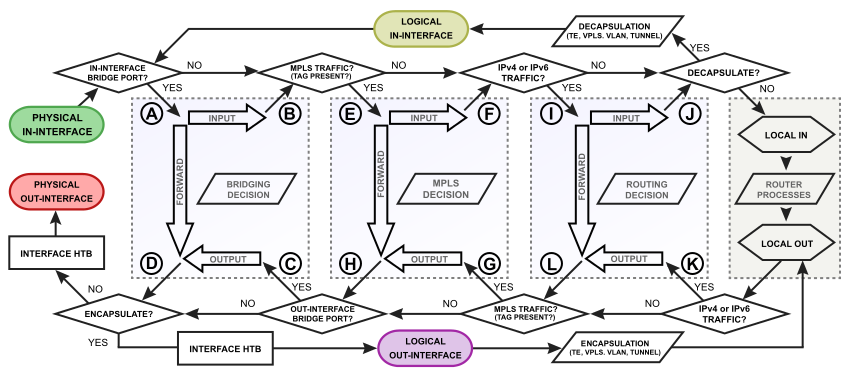

# MTCSE (MiKroTik Certified Security Engineer)

## Steps to secure Mikrotik:

* `always update your router-os to the latest stable release.`


* `If the bandwidth test server is not being used, it should be disabled.`
```
tool/bandwidth-server/set enabled=no
```

* `disable mac ping `
```
/tool mac-server ping
set enabled=no
```

* `if you're not using mac-telnet then disable it.`


* `Always generate a new user with administrative privileges and remove the default admin user.`


* `if you're not using RoMon then disable it. by default this service is disable.`


* `If your MikroTik serves as a DNS server within your network, block incoming DNS queries from the WAN interface.`


```
/ip firewall filter
add action=drop chain=input dst-port=53 in-interface=WAN-Interface protocol=udp

```

* `disable unused interfaces`

* `always use a syslog server and send logs to a syslog server`


[step by step to install rsyslog on rocky linux](https://linuxhint.com/setup-syslog-rocky-linux-9/)

```
/system logging action
add name=SyslogServerRockyLinux remote=192.168.56.102 src-address=\
    192.168.56.105 target=remote
/system logging
set 0 action=remote
set 1 action=remote
set 2 action=remote

```

## packet-flow
It is good to understand the packet flow in MikroTik devices.

------------- ---------- 

-------------- ----------

-------------- ----------


-------------- -----------


It is advantageous to discard packets in the raw table as it consumes fewer resources on the device.


`MikroTik suggests adding the following policy in the INPUT chain  to your router for enhanced security.`
```

/ip firewall filter
add action=accept chain=input connection-state=established,related
add action=accept chain=input src-address-list=allowed_to_router
add action=accept chain=input protocol=icmp
add action=drop chain=input

/ip firewall address-list
add address=10.10.10.1-10.10.10.30 list=allowed_to_router

```

`The following address list is invalid in the WAN network.`

```
/ip firewall address-list
add address=0.0.0.0/8 comment=RFC6890 list=not_in_internet
add address=172.16.0.0/12 comment=RFC6890 list=not_in_internet
add address=192.168.0.0/16 comment=RFC6890 list=not_in_internet
add address=10.0.0.0/8 comment=RFC6890 list=not_in_internet
add address=169.254.0.0/16 comment=RFC6890 list=not_in_internet
add address=127.0.0.0/8 comment=RFC6890 list=not_in_internet
add address=224.0.0.0/4 comment=Multicast list=not_in_internet
add address=198.18.0.0/15 comment=RFC6890 list=not_in_internet
add address=192.0.0.0/24 comment=RFC6890 list=not_in_internet
add address=192.0.2.0/24 comment=RFC6890 list=not_in_internet
add address=198.51.100.0/24 comment=RFC6890 list=not_in_internet
add address=203.0.113.0/24 comment=RFC6890 list=not_in_internet
add address=100.64.0.0/10 comment=RFC6890 list=not_in_internet
add address=240.0.0.0/4 comment=RFC6890 list=not_in_internet
add address=192.88.99.0/24 comment="6to4 relay Anycast [RFC 3068]" list=not_in_internet


```

`now add below firewall rules for your clients.`
```
/ip firewall filter
add action=fasttrack-connection chain=forward comment=FastTrack connection-state=established,related
add action=accept chain=forward connection-state=established,related
add action=drop chain=forward connection-state=invalid log=yes log-prefix=invalid
add action=drop chain=forward dst-address-list=not_in_internet in-interface=bridge1 log=yes log-prefix=!public_from_LAN out-interface=!bridge1
add action=drop chain=forward connection-nat-state=!dstnat connection-state=new in-interface=ether1 log=yes log-prefix=!NAT
add action=drop chain=forward in-interface=ether1 log=yes log-prefix=!public src-address-list=not_in_internet
add action=drop chain=forward in-interface=bridge1 log=yes log-prefix=LAN_!LAN src-address=!192.168.88.0/24


```


`The following rules are employed to identify the source IP address attempting to port-scan our router and block it`
```
/ip firewall mangle
add action=add-src-to-address-list address-list=port-scan address-list-timeout=\
    1d chain=prerouting protocol=tcp psd=21,3s,3,1
/ip firewall raw
add action=drop chain=prerouting src-address-list=port-scan

```
its good to drop packets in `raw table` like above.


`Identify the source IP that is making repeated attempts with incorrect usernames and passwords through VPNS.`

```
# find vpns login failure.

/ip firewall mangle
add action=add-dst-to-address-list address-list=vpn-authentication-faild3 \
    address-list-timeout=1h1m chain=output comment=\
    ssh-web-authentication-failure-finder3 content="authentication failed" \
    dst-address-list=vpn-authentication-faild2
add action=add-dst-to-address-list address-list=vpn-authentication-faild2 \
    address-list-timeout=1m chain=output comment=\
    ssh-web-authentication-failure-finder2 content="authentication failed" \
    dst-address-list=vpn-authentication-faild1
add action=add-dst-to-address-list address-list=vpn-authentication-faild1 \
    address-list-timeout=1m chain=output comment=\
    ssh-web-authentication-failure-finder1 content="authentication failed"

/ip firewall filter
add action=drop chain=input src-address-list=vpn-authentication-faild3


```